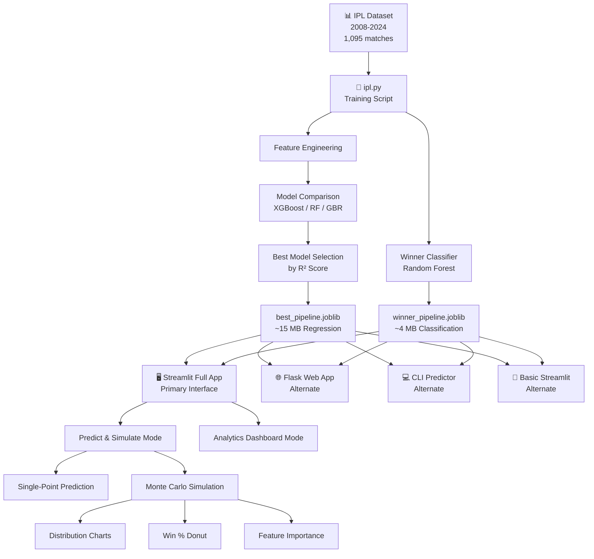
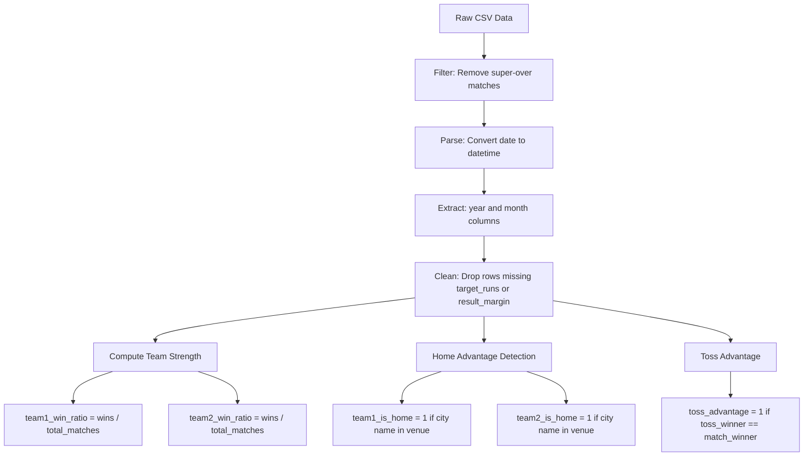
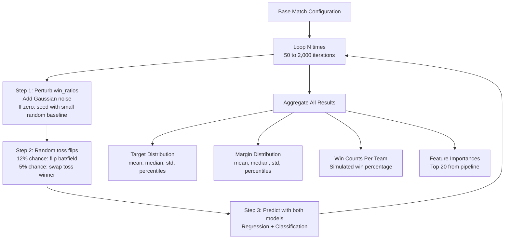

# 🏏 IPL Match Predictor & Analytics Suite

**Machine Learning-powered IPL match outcome prediction with Monte Carlo simulation and interactive analytics**

[](https://python.org)
[](https://streamlit.io)
[](https://scikit-learn.org)
[](https://xgboost.readthedocs.io)
[](https://plotly.com)

> Predict match winners, target scores, and victory margins for any IPL matchup using ensemble ML models trained on **17 seasons (2008-2024)** of real IPL data. Explore historical analytics through an interactive dashboard with head-to-head heatmaps, toss advantage trends, and more.

---

## Table of Contents

- [Overview](#overview)
- [Key Features](#key-features)
- [Project Architecture](#project-architecture)
- [Dataset](#dataset)
- [Machine Learning Pipeline](#machine-learning-pipeline)
- [Monte Carlo Simulation Engine](#monte-carlo-simulation-engine)
- [Application Interfaces](#application-interfaces)
- [Analytics Dashboard](#analytics-dashboard)
- [Installation and Setup](#installation-and-setup)
- [Usage](#usage)
- [Project Structure](#project-structure)
- [Technical Deep Dive](#technical-deep-dive)
- [Limitations and Future Work](#limitations-and-future-work)

---

## Overview

This project is an end-to-end machine learning system that:

1. **Trains** multiple ensemble regression and classification models on historical IPL match data (2008-2024)
2. **Predicts** three key outcomes for any hypothetical IPL match:
   - **Target score** - first innings total in runs
   - **Victory margin** - runs or wickets, contextually interpreted based on toss decision
   - **Match winner** - with calibrated win probabilities
3. **Simulates** match uncertainty via a **Monte Carlo engine** that runs hundreds of perturbed scenarios
4. **Visualises** historical IPL analytics through an interactive dashboard with Plotly charts

---

## Key Features

| Feature | Description |
|:--------|:------------|
| 🤖 **Multi-Model Comparison** | Trains XGBoost, Random Forest, and Gradient Boosting regressors - auto-selects the best |
| 🎯 **Dual Prediction Heads** | Multi-output regression (target runs + margin) and binary classification (winner) |
| 🎲 **Monte Carlo Simulation** | 50 to 2,000 perturbed simulations to quantify prediction uncertainty |
| 📊 **Interactive Analytics** | Head-to-head heatmaps, toss advantage trends, home/away splits, result distributions |
| 🔧 **Feature Engineering** | Team win ratios, home advantage detection, toss advantage flags, temporal features |
| 📈 **Rich Visualisations** | Histograms with boxplots, donut charts, line trends, stacked bars, heatmaps via Plotly |
| 🚀 **Multiple Interfaces** | Full Streamlit app, basic Streamlit, Flask API, CLI |
| 📤 **CSV Upload Support** | Upload your own IPL CSV to refresh analytics on new data |

---

## Project Architecture



---

## Dataset

**File:** `IPL_2008-2024.csv`

| Property | Value |
|:---------|:------|
| **Records** | 1,095 matches |
| **Time Span** | 17 IPL seasons (2008 to 2024) |
| **Columns** | 20 |
| **Format** | CSV with header row |

### Dataset Schema

| Column | Type | Description |
|:-------|:-----|:------------|
| `id` | int | Unique match identifier |
| `season` | int | IPL season year |
| `city` | str | City where the match was played |
| `date` | date | Match date (YYYY-MM-DD) |
| `match_type` | str | League, Playoff, Qualifier, Eliminator, Final |
| `player_of_match` | str | Player of the match |
| `venue` | str | Stadium name |
| `team1` | str | First team listed |
| `team2` | str | Second team listed |
| `toss_winner` | str | Team that won the toss |
| `toss_decision` | str | bat or field |
| `winner` | str | Match winner |
| `result` | str | Win type - runs, wickets, or other |
| `result_margin` | mixed | Numeric margin of victory |
| `target_runs` | int | First innings total + 1 (target for chasing team) |
| `target_overs` | float | Overs available for chasing team |
| `super_over` | str | Y or N - whether match went to a super over |
| `method` | str | D/L if Duckworth-Lewis was applied, else NA |
| `umpire1` | str | On-field umpire 1 |
| `umpire2` | str | On-field umpire 2 |

---

## Machine Learning Pipeline

The training pipeline is implemented in `ipl.py` and follows a structured workflow.

### Data Preprocessing



### Final Feature Set

**Categorical Features (7):**

| Feature | Example Values |
|:--------|:---------------|
| `city` | Mumbai, Bangalore, Delhi, Chennai |
| `match_type` | League, Playoff, Final |
| `team1` | Mumbai Indians, Chennai Super Kings |
| `team2` | Royal Challengers Bangalore, KKR |
| `toss_winner` | Any team name |
| `toss_decision` | bat, field |
| `venue` | Wankhede Stadium, M Chinnaswamy Stadium |

**Numerical Features (8):**

| Feature | Range | Description |
|:--------|:------|:------------|
| `season` | 2008-2024 | IPL season year |
| `year` | 2008-2024 | Calendar year from date |
| `month` | 1-12 | Calendar month from date |
| `team1_win_ratio` | 0.0-1.0 | Historical win percentage of team 1 |
| `team2_win_ratio` | 0.0-1.0 | Historical win percentage of team 2 |
| `team1_is_home` | 0 or 1 | Whether team 1 is playing at home |
| `team2_is_home` | 0 or 1 | Whether team 2 is playing at home |
| `toss_advantage` | 0 or 1 | Whether toss winner won the match |

### Preprocessing Pipeline

- **Categorical features** are processed through `OneHotEncoder` with `handle_unknown='ignore'`
- **Numerical features** are scaled via `StandardScaler`
- Both are combined using sklearn `ColumnTransformer`

### Models Compared

Three ensemble methods are trained and evaluated via an 80/20 train-test split:

| Model | Regressor | n_estimators | max_depth | learning_rate |
|:------|:----------|:-------------|:----------|:--------------|
| **XGBoost** | XGBRegressor | 200 | 7 | 0.05 |
| **Random Forest** | RandomForestRegressor | 200 | 15 | N/A |
| **Gradient Boosting** | GradientBoostingRegressor | 200 | 7 | 0.05 |

### Multi-Output Regression

Each model is wrapped in sklearn `MultiOutputRegressor` to jointly predict **two targets**:

| Target | Column | Description |
|:-------|:-------|:------------|
| Target 1 | `target_runs` | First innings total (what the chasing team needs) |
| Target 2 | `result_margin_numeric` | How many runs/wickets the match was won by |

**Evaluation metrics per model, per target:**
- Mean Absolute Error (MAE)
- Mean Squared Error (MSE)
- R-squared Score (R²)

The best model is selected by the **highest average R²** across both outputs.

### Winner Classification

A separate **Random Forest Classifier** (`n_estimators=200`, `max_depth=15`) predicts the binary outcome:

| Prediction | Meaning |
|:-----------|:--------|
| `1` | Team 1 wins |
| `0` | Team 2 wins |

This model also outputs **calibrated win probabilities** via `predict_proba()`.

**Classification metrics:** Accuracy, Precision, Recall, F1 Score

### Model Persistence

Both trained pipelines (preprocessor + model) are serialized using `joblib`:

| File | Approx Size | Contents |
|:-----|:------------|:---------|
| `best_pipeline.joblib` | 15 MB | Full sklearn Pipeline: ColumnTransformer then MultiOutputRegressor (best of 3) |
| `winner_pipeline.joblib` | 4 MB | Full sklearn Pipeline: ColumnTransformer then RandomForestClassifier |

---

## Monte Carlo Simulation Engine

The simulation engine adds **uncertainty quantification** to predictions by running many perturbed scenarios. A single-point prediction hides the inherent randomness in cricket - Monte Carlo reveals the full distribution of possible outcomes.

### How It Works



### Simulation Parameters

| Parameter | Range | Default | Effect |
|:----------|:------|:--------|:-------|
| `n` (simulations) | 50 to 2,000 | 500 | More simulations = smoother distributions, slower execution |
| `noise_level` | 0.0 to 0.2 | 0.02 | Higher noise = wider spread in predictions |

### What Gets Visualised

| Chart | Description |
|:------|:------------|
| **Histogram + Box Plot** | Target runs distribution (5th-95th percentile trimmed with mean/median lines) |
| **Histogram + Box Plot** | Victory margin distribution |
| **Donut Chart** | Simulated win percentage split between Team 1 and Team 2 |
| **Horizontal Bar Chart** | Top 20 feature importances extracted from pipeline internals |

---

## Application Interfaces

### 1. Full Streamlit App (Primary)

**File:** `app_streamlit_full.py` (635 lines)

This is the **main application** with two modes accessible via sidebar radio buttons.

#### Mode A: Predict and Simulate

| Section | What It Does |
|:--------|:-------------|
| **Team Selection** | Dropdowns populated from CSV data (or fallback list of 8 teams) |
| **Match Config** | Venue (text input), toss decision (bat/field), season, month |
| **Quick Predict** | Single-point prediction with target, margin, winner, and win probabilities |
| **Monte Carlo** | Configurable simulations (50-2,000) with noise level control |
| **Results Panel** | Single-point metrics + simulation summary stats in JSON |
| **Win Donut** | Interactive Plotly donut chart of simulated win split |
| **Distributions** | Dual histogram+boxplot figures for both target and margin |
| **Feature Importance** | Horizontal bar chart of top contributing features |

#### Mode B: Analytics Dashboard

A comprehensive historical analytics view - see [Analytics Dashboard](#analytics-dashboard) section below.

**Run command:**

```bash
streamlit run app_streamlit_full.py
```

### 2. Alternate Interfaces

Located in the `Alternates/` directory. These provide simpler or different ways to interact with the same trained models.

#### a) Basic Streamlit

**File:** `Alternates/app_streamlit.py` (59 lines)

Minimal Streamlit UI with text inputs for teams/venue, a single "Predict" button, and clean output of target, margin, and win probability. No Monte Carlo, no analytics.

```bash
streamlit run Alternates/app_streamlit.py
```

#### b) Analytics Streamlit

**File:** `Alternates/app_streamlit_analytics.py` (282 lines)

Mid-tier version with sidebar inputs, Monte Carlo simulation, distribution histograms, feature importances, and a donut chart - but without the full analytics dashboard tab.

```bash
streamlit run Alternates/app_streamlit_analytics.py
```

#### c) Flask Web App

**File:** `Alternates/app_flask.py` (74 lines)

Lightweight Flask server with an HTML form. Submit team names and venue, get predictions rendered as simple HTML. Good for embedding or API-style usage.

```bash
python Alternates/app_flask.py
# Opens at http://127.0.0.1:5000
```

#### d) CLI Predictor

**File:** `Alternates/cli_predict.py` (71 lines)

Interactive terminal-based predictor. Prompts for team names, venue, and toss decision via `input()`, then prints formatted prediction to stdout.

```bash
python Alternates/cli_predict.py
```

---

## Analytics Dashboard

The analytics dashboard (Mode B in the full app) provides deep historical insights from the IPL dataset.

### All 9 Visualisations

| No. | Chart Name | Chart Type | What It Shows |
|:----|:-----------|:-----------|:--------------|
| 1 | **Top-Level Stats** | Metric cards | Total matches, average target runs, average result margin |
| 2 | **Model R² Comparison** | Bar chart | R² scores for saved model vs baseline (mean predictor) |
| 3 | **Home vs Away Counts** | Donut chart | Overall proportion of home vs away matches |
| 4 | **Target Runs Trend** | Line chart | Average target runs per season over time |
| 5 | **Result Margins Distribution** | Histogram + Boxplot | Spread of victory margins with trimming controls |
| 6 | **Head-to-Head Heatmap** | Heatmap | Win rate matrix: every team vs every opponent |
| 7 | **Home vs Away Wins per Team** | Grouped bar chart | Each team's home wins vs away wins side by side |
| 8 | **Result Type per Year** | Stacked bar chart | Yearly breakdown: wins by runs vs wickets vs other |
| 9 | **Bat-First Advantage** | Line chart + stat | Historical bat-first win percentage trend across seasons |

### Data Handling

- **Default:** Loads `IPL_2008-2024.csv` from the working directory
- **Upload:** Users can upload a custom CSV via the sidebar file uploader
- **Auto-parsing:** Dates are parsed, `year` and `month` are extracted automatically
- **Graceful degradation:** Charts show informational messages if expected columns are absent

---

## Installation and Setup

### Prerequisites

- Python 3.8 or higher
- pip (Python package manager)

### Step 1: Clone the Repository

```bash
git clone https://github.com/shaawtymaker/IPL-PREDICTOR-.git
cd IPL-PREDICTOR-
```

### Step 2: Install Dependencies

```bash
pip install pandas numpy scikit-learn xgboost joblib streamlit plotly flask
```

<details>
<summary>📦 Click to see full dependency list with roles</summary>

<br/>

| Package | Minimum Version | Role |
|:--------|:----------------|:-----|
| `pandas` | 1.5+ | Data loading, manipulation, feature engineering |
| `numpy` | 1.23+ | Numerical operations, Monte Carlo noise generation |
| `scikit-learn` | 1.2+ | ML pipelines, preprocessing, models, metrics |
| `xgboost` | 1.7+ | XGBRegressor for multi-output regression |
| `joblib` | 1.2+ | Model serialization and deserialization |
| `streamlit` | 1.28+ | Interactive web UI framework |
| `plotly` | 5.15+ | Interactive charts (histograms, heatmaps, pies, bars) |
| `flask` | 2.3+ | Lightweight web server (alternate interface only) |

</details>

### Step 3: Train the Models (Optional)

Pre-trained model files are included in the repo. If you want to retrain from scratch:

```bash
python ipl.py
```

This will:
1. Load and preprocess `IPL_2008-2024.csv`
2. Engineer features (win ratios, home flags, toss advantage)
3. Train 3 regression models + 1 classification model
4. Print comparative metrics for all models
5. Save `best_pipeline.joblib` and `winner_pipeline.joblib`

### Step 4: Launch the Application

```bash
streamlit run app_streamlit_full.py
```

The app will open in your default browser at `http://localhost:8501`.

---

## Usage

### Quick Prediction

1. Launch the app and select **Predict & Simulate** mode in the sidebar
2. Choose **Team 1** and **Team 2** from the dropdowns
3. Enter the **venue** name
4. Set **toss decision** (bat/field), **season**, and **month**
5. Click **Quick predict (single)** for instant results

### Monte Carlo Simulation

1. Adjust the **Simulations** slider (50 to 2,000)
2. Set the **Noise level** (0.0 to 0.2) to control perturbation width
3. Click **Predict & Run Simulations**
4. Explore the donut chart, distribution histograms, and feature importance chart

### Analytics Dashboard

1. Switch to **Analytics Dashboard** mode via the sidebar
2. Ensure `IPL_2008-2024.csv` is in the working directory (or upload one)
3. Scroll through the suite of interactive charts
4. Toggle **Show full range** on the margins distribution for the unclipped view
5. Click **Compute R² now** to evaluate model performance against the dataset

### CLI Quick Test

```
$ python Alternates/cli_predict.py

IPL MATCH PREDICTOR - CLI MODE
Enter Team 1: Mumbai Indians
Enter Team 2: Chennai Super Kings
Enter Venue: Wankhede Stadium
Toss Decision (bat/field): field

----- MATCH PREDICTION -----
Match: Mumbai Indians vs Chennai Super Kings
Venue: Wankhede Stadium
Predicted Target Score: 168
Mumbai Indians is predicted to win by 4 wickets (~24 balls left).

Win Probability:
Mumbai Indians: 62.3%
Chennai Super Kings: 37.7%
------------------------------
```

---

## Project Structure

```
IPL-PREDICTOR-/
│
├── ipl.py                            # Model training script
│                                     #   - Data loading and cleaning
│                                     #   - Feature engineering
│                                     #   - 3-model comparison (XGBoost, RF, GBR)
│                                     #   - Winner classification model
│                                     #   - Example predictions
│                                     #   - Model serialization
│
├── app_streamlit_full.py             # Primary application (635 lines)
│                                     #   - Model and CSV loading (cached)
│                                     #   - Match row builder
│                                     #   - Monte Carlo simulation engine
│                                     #   - Distribution plotting helper
│                                     #   - Predict & Simulate tab
│                                     #   - Analytics Dashboard tab
│
├── IPL_2008-2024.csv                 # Dataset (1,095 matches, 20 columns)
├── best_pipeline.joblib              # Trained regression pipeline (~15 MB)
├── winner_pipeline.joblib            # Trained classification pipeline (~4 MB)
│
└── Alternates/
    ├── app_streamlit.py              # Basic Streamlit predictor (59 lines)
    ├── app_streamlit_analytics.py    # Mid-tier with Monte Carlo (282 lines)
    ├── app_flask.py                  # Flask web form (74 lines)
    └── cli_predict.py                # Terminal CLI predictor (71 lines)
```

---

## Technical Deep Dive

### Preprocessing Pipeline (sklearn)

```python
ColumnTransformer([
    ('cat', OneHotEncoder(handle_unknown='ignore', sparse_output=False),
           ['city', 'match_type', 'team1', 'team2', 'toss_winner',
            'toss_decision', 'venue']),
    ('num', StandardScaler(),
           ['season', 'year', 'month', 'team1_win_ratio', 'team2_win_ratio',
            'team1_is_home', 'team2_is_home', 'toss_advantage'])
])
```

The `OneHotEncoder` with `handle_unknown='ignore'` ensures that new teams or venues not seen during training do not crash inference. They simply get a zero vector for that categorical slot.

### Home Advantage Heuristic

```python
team1_is_home = 1 if team1.split()[0].lower() in venue.lower() else 0
```

Checks if the **first word** of the team name (e.g., "Mumbai" from "Mumbai Indians") appears in the venue string. For example:
- "Mumbai" in "DY Patil Stadium, Mumbai" = **match (home)**
- "Mumbai" in "Wankhede Stadium" = **no match (away)**

This is a simple heuristic and may not always be accurate, but provides a useful signal.

### Margin Interpretation Logic

The predicted margin is contextually interpreted based on the toss decision:

| Toss Decision | Interpretation | Margin Unit | Clamping |
|:--------------|:---------------|:------------|:---------|
| **bat** | Team batting first set a target | Runs | None |
| **field** | Team bowling first defended | Wickets | Clamped to 1-10 |

When the margin is in wickets, an approximate balls-left estimate is computed as `wickets x 6`.

### Streamlit Caching Strategy

| Decorator | Used For | TTL |
|:----------|:---------|:----|
| `@st.cache_resource` | Model loading (heavy `.joblib` files) | Permanent (app lifetime) |
| `@st.cache_data` | CSV parsing, team list extraction | Permanent |
| `@st.cache_data(ttl=3600)` | R² computation (expensive operation) | 1 hour |

### Distribution Plotting Helper

The `plot_distribution_with_box()` function creates publication-quality Plotly figures with:

- **Freedman-Diaconis binning** - automatic optimal bin count based on IQR
- **Percentile trimming** - removes extreme outliers (configurable, default 5th-95th)
- **Dual-panel layout** - histogram on top (78% height) + boxplot on bottom (22%)
- **Mean/median reference lines** - orange dashed line (mean) and green dotted line (median)
- **Outlier annotation** - transparent overlay showing how many data points were clipped

---

## Limitations and Future Work

### Current Limitations

| Limitation | Description |
|:-----------|:------------|
| **No ball-by-ball data** | Predictions are match-level only; no over-by-over modeling |
| **Home advantage heuristic** | Simple string matching; doesn't handle neutral venues or franchise relocations |
| **Static team strength** | Win ratios computed across all historical data, not season-specific or form-weighted |
| **No player-level features** | Team composition, player form, injuries, and playing XI are not modeled |
| **Toss advantage leakage** | `toss_advantage` flag uses actual match winner during training (potential data leakage) |

### Potential Enhancements

- [ ] **Rolling team form** - Compute win ratios over sliding windows (last N matches)
- [ ] **Player impact scores** - Incorporate key player availability and form
- [ ] **Venue-specific models** - Train separate models per venue cluster
- [ ] **Live score integration** - Extend to live match prediction with ball-by-ball streaming
- [ ] **Hyperparameter tuning** - Add GridSearchCV or Optuna for systematic optimization
- [ ] **Model explainability** - Integrate SHAP values for individual prediction explanations
- [ ] **Docker deployment** - Containerize for one-command cloud deployment
- [ ] **FastAPI endpoint** - RESTful API for programmatic access

---

## License

This project is open source and available for educational and research purposes.

---

**Built with ❤️ for cricket analytics**

*If you find this project useful, consider giving it a ⭐ on GitHub!*
